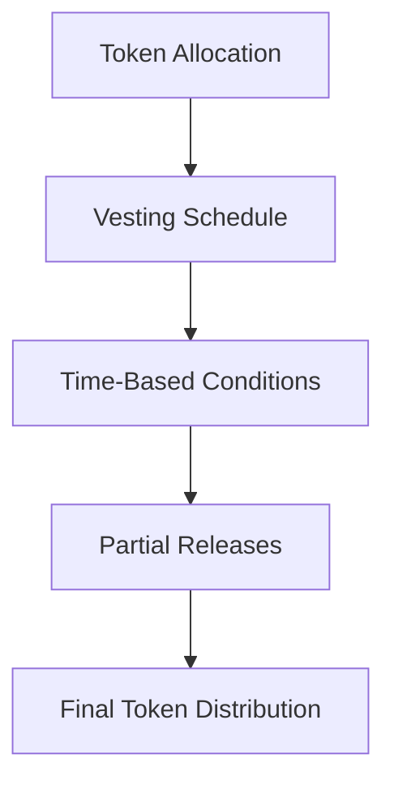

# Timelock Heuristic: Smart Contract Token Vesting

## Overview

Timelock Heuristic is a sophisticated Clarity smart contract implementing a flexible, secure token vesting and release mechanism. Designed for decentralized governance and controlled token distribution, this contract provides granular time-based fund management.

## Key Features

- Time-based token vesting schedules
- Configurable release conditions
- Granular access controls
- Transparent fund tracking
- Secure token distribution

## Architecture

The core contract enables:
- Creating custom vesting schedules
- Partial and full token releases
- Multiple concurrent vesting plans
- Role-based access management



## Contract Documentation

### Timelock Core Contract

The main contract (`timelock-core`) manages sophisticated token vesting:

#### Key Functions
- Create vesting schedules
- Compute vested token amounts
- Manage token releases
- Control fund distributions
- Track historical allocations

#### Access Control
- Contract owner: Full administrative rights
- Beneficiaries: Can claim vested tokens
- Authorized managers: Modify vesting parameters

## Getting Started

### Prerequisites
- Clarinet
- Stacks wallet

### Basic Usage

1. Create a vesting schedule:
```clarity
(contract-call? .timelock-core create-vesting-schedule 
  principal-recipient 
  total-amount 
  start-time 
  end-time 
  release-frequency)
```

2. Check vesting status:
```clarity
(contract-call? .timelock-core get-vesting-details principal-recipient)
```

## Function Reference

### Vesting Management
- `create-vesting-schedule(principal, uint, uint, uint, uint)`: Define vesting plan
- `compute-vested-amount(principal)`: Calculate claimable tokens
- `release-tokens(principal)`: Distribute vested tokens

### Administrative Functions
- `modify-vesting-schedule(principal, uint)`: Update schedule parameters
- `revoke-vesting(principal)`: Cancel vesting plan

## Development

### Testing
1. Clone repository
2. Run Clarinet console
3. Execute test commands

### Local Setup
1. Install Clarinet
2. Initialize project
3. Configure vesting parameters

## Security Considerations

### Protective Measures
- Immutable release conditions
- Strict access controls
- Transparent transaction logging
- Preventative overflow checks

### Best Practices
- Carefully design vesting schedules
- Implement multi-signature approvals
- Regularly audit token allocations
- Maintain transparent release mechanisms

## License

MIT License